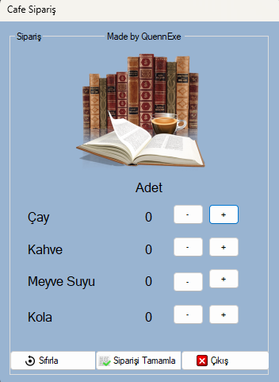

# Sipariş Takip Uygulaması (Windows Forms)

Bu proje, basit bir Windows Forms arayüzü ile çalışan bir **içecek sipariş takip** uygulamasıdır. Kullanıcı, dört farklı içecek için sipariş adedi belirleyebilir, sıfırlayabilir ve toplam siparişi görebilir.

## Özellikler

- Çay, Kahve, Meyve Suyu ve Kola için adet artırma/azaltma
- Tüm siparişleri sıfırlama butonu
- Siparişi tamamlama ve mesaj kutusunda gösterme
- Çıkış butonu ile uygulamadan çıkış

## Ekran Görüntüsü

<p align="center">
  

## Kullanılan Teknolojiler

- C#
- .NET Framework
- Windows Forms (WinForms)

## Başlangıç

Projeyi çalıştırmak için Visual Studio kurulu olmalıdır.

### 1. Klonlama

```bash
git clone https://github.com/kullaniciadi/siparis-uygulamasi.git